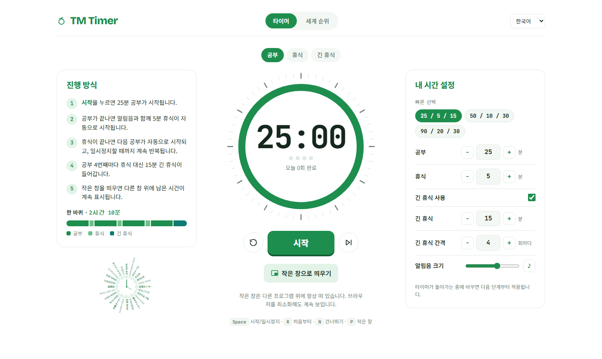
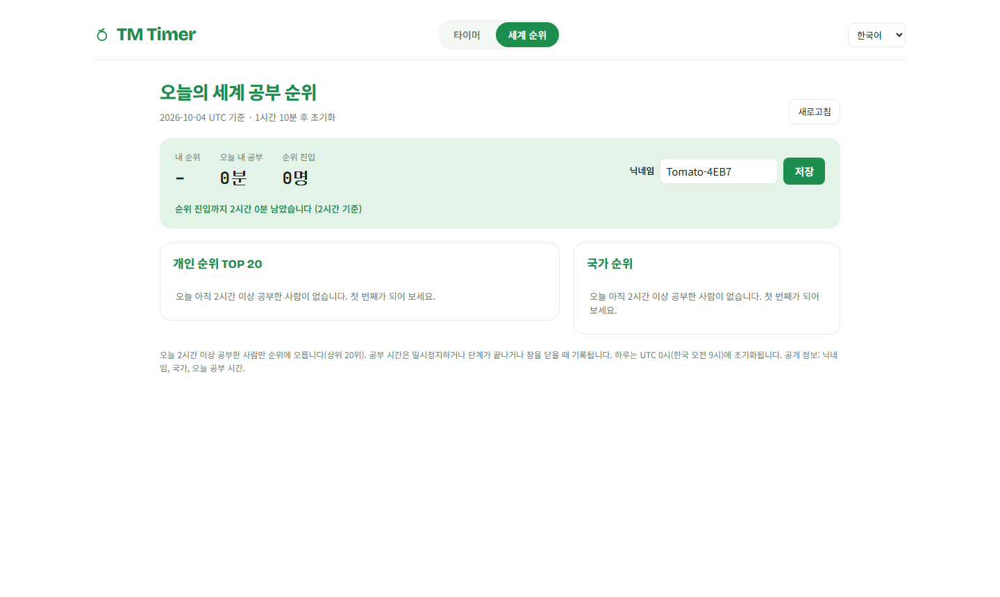

# TM Timer

**A Pomodoro study timer with a daily world study ranking.**

🌐 **https://tm-timer.pages.dev**



## Features

- ⏱ **Auto-looping Pomodoro** — 25 min focus → 5 min break on repeat, with a 15 min long break after every 4th focus session
- 🔔 **Chimes** on every phase change (silent on the very first start)
- 🪟 **Pop-out mini timer** that stays on top of other windows, even when the browser is minimized (Document Picture-in-Picture, with a video PiP fallback)
- ⚙️ **Custom durations** for focus, break, long break and long-break interval, plus presets 25/5/15 · 50/10/30 · 90/20/30
- 🌍 **Daily world ranking** — the top 20 people who studied 2+ hours today, plus a country ranking
- 🈯 **Four languages** — English, Korean, Japanese, Chinese



## How it works

```
public/                   Static site — a single index.html, no build step, no dependencies
functions/api/ranking.js  World ranking API (Cloudflare Pages Functions)
schema.sql                Ranking tables (Cloudflare D1 / SQLite)
tests/ranking.test.mjs    API tests that run against an in-memory SQLite stand-in for D1
wrangler.toml             Cloudflare configuration
```

**Timer.** Remaining time is computed from an end timestamp, and ticks come from a Web Worker, so the countdown stays accurate when the tab is in the background or minimized.

**Ranking.** When you press Start, the server records the time on its own clock. When you pause, finish a phase, restart or close the page, the client reports the focus minutes since then. The server never credits more than the time that actually elapsed (plus one minute of slack), at most 180 minutes per report and 960 minutes per day, so spamming Start/Stop or editing requests cannot inflate the total. Only people with 120+ minutes in the current UTC day are listed, top 20.

**Privacy.** Only a nickname, a country code and today's focus minutes are stored and shown. The country comes from Cloudflare's IP geolocation (`request.cf.country`); IP addresses are not stored. Each browser gets a random UUID kept in `localStorage`.

## Deploy your own

```bash
npx wrangler login
npx wrangler d1 create tm-timer          # put the printed database_id into wrangler.toml
npx wrangler d1 execute tm-timer --remote --file=schema.sql
npx wrangler pages deploy
```

Drag-and-drop upload in the Cloudflare dashboard does not deploy `functions/`, so use the CLI.

## Tests

Requires Node 22.5+ (built-in `node:sqlite`).

```bash
node --no-warnings tests/ranking.test.mjs
```
